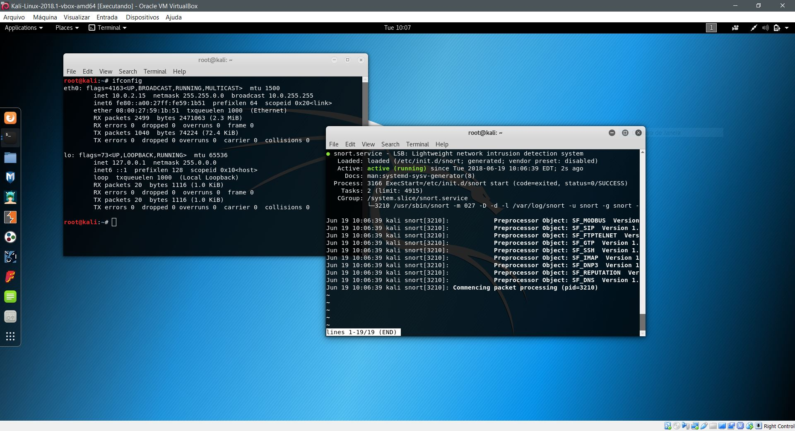
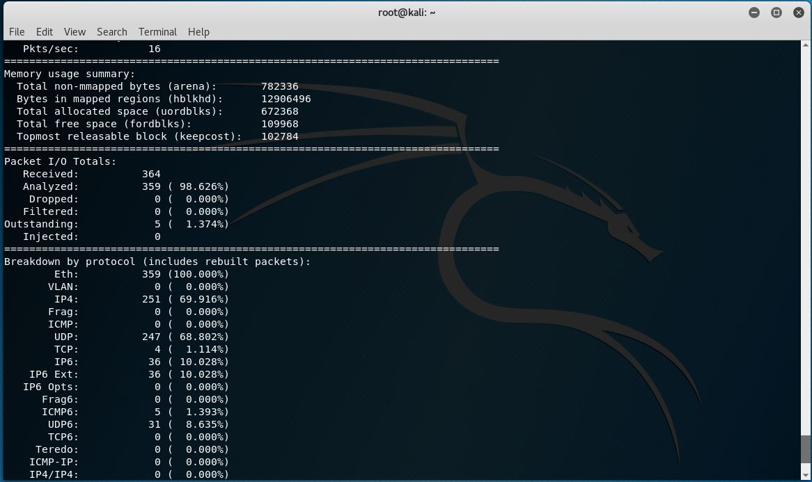
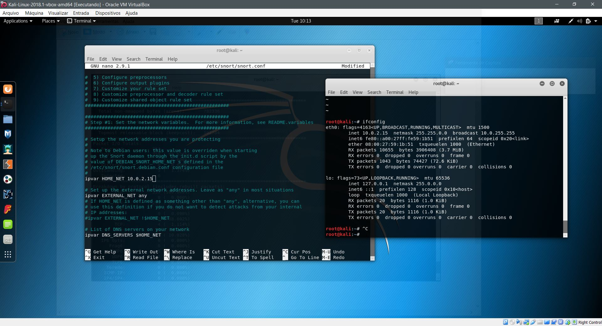
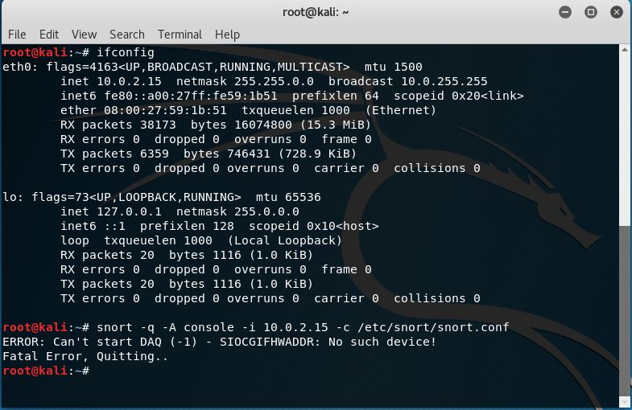

# Relatório: Prática com Snort (Intrusion Detection System)

O tutorial apresenta os conceitos sobre os mecanismos de detecção de intrusão (IDS), além de uma prática de simulação de ataque e captura com um software de IDS, o Snort.

Para relização do tutorial, foi feita a instalação do snort em uma máquina virtual Linux (Kali), através do comando:

> sudo apt install snort

Verificou-se a instalação reiniciando o serviço, iniciando o monitoramento da rede:

> service snort restart

> service snort status

> snort -v

Um dos passos do tutorial é direcionar o monitoramento de rede para o IP da máquina virtual linux. Para isso, o arquivo snort.conf foi editado para indicar o IP em que o snort deve detectar possíveis ataques:

> sudo nano /etc/snort/snort.conf

Logo após, o snort deve ser configurado para detectar ataques com o IP definido no arquivo de configuração.

> snort -q -A console -i 10.0.2.15 -c /etc/snort/snort.conf

Nessa etapa do tutorial, me deparei com um erro que não consegui resolver. Mesmo tentando em diferentes interfaces de rede, o snort acusa um erro onde não é possível iniciar o DAQ e finaliza o processo de detecção:

O conteúdo do tutorial é muito interessante, porém, tive dificuldades em alguns conceitos específicos de redes (o erro que encontrei pode ser justamente causado por alguma configuração incorreta por falta desse conhecimento). Levei um bom tempo tentando solucioná-lo,mas não obtive sucesso. No geral, acredito que entendi o conceito principal de uma IDS, que ouve o tráfego da rede de maneira oculta, e previne invasões. O snort parece uma ferramenta muito boa para este uso, e pode ser melhor explorada futuramente.
